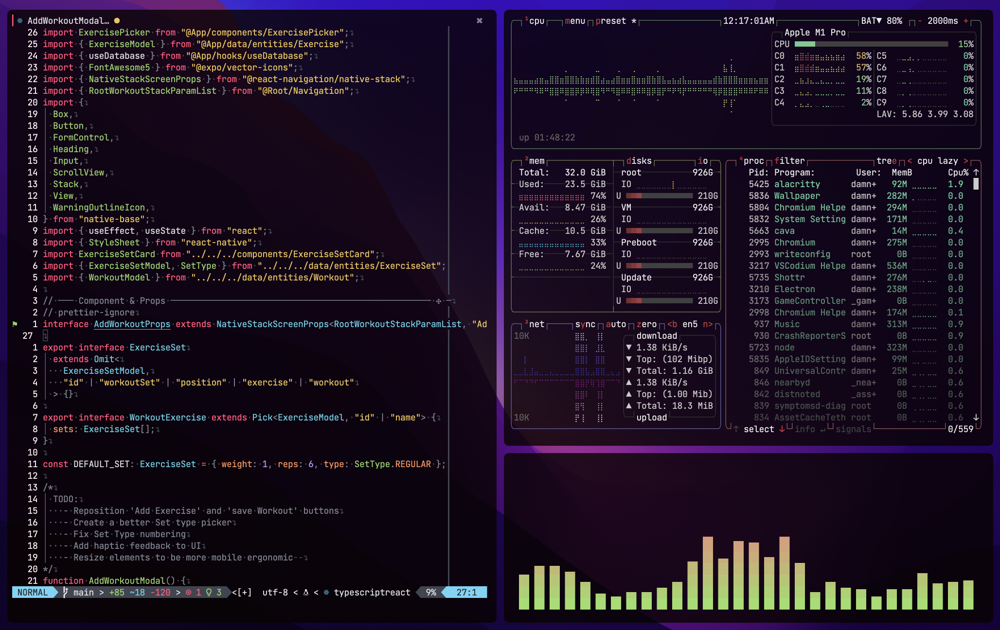

# DamnStraight's dotfiles

# Software
## Mac:
- Tiling manager: [yabai](https://github.com/koekeishiya/yabai)
- Package manager: [Homebrew](https://brew.sh/)
- Terminal: [Alacritty](https://github.com/alacritty/alacritty)
- Editor: [Neovim](https://neovim.io/) / [VSCodium](https://github.com/VSCodium/vscodium)
- Browser: [Ungoogled Chromium](https://github.com/ungoogled-software/ungoogled-chromium) / [LibreWolf](https://librewolf.net/) / [Orion](https://browser.kagi.com/)
- Media Player: [IINA](https://github.com/iina/iina)
- Node Version Manager: [fnm](https://github.com/Schniz/fnm)
- Shell: [zsh](https://www.zsh.org/)
- Screenshots: [Shottr](https://shottr.cc/)
- Audio Utility: [BackgroundMusic](https://github.com/kyleneideck/BackgroundMusic)
- Keyboard Customization: [Karabiner-elements](https://github.com/pqrs-org/Karabiner-Elements)
- Application Launcher: [Raycast](https://www.raycast.com/)
- Password Manager: [Keepassxc](https://keepassxc.org/)
- Unarchiver: [Keka](https://github.com/aonez/Keka)
- SDK Manager: [SDKMAN!](https://sdkman.io/)
## Windows:
- Package manager: [Winget](https://github.com/microsoft/winget-cli)
- Terminal: [Windows Terminal](https://github.com/microsoft/terminal)
- Editor: [Neovim](https://neovim.io/) / [VSCode](https://code.visualstudio.com/) *(WSL extension doesn't worth with VSCodium)*
- Browser: [Ungoogled Chromium](https://github.com/ungoogled-software/ungoogled-chromium) / [LibreWolf](https://librewolf.net/)
- Video Player: [MPV](https://mpv.io/)
- Music Player: [MusicBee](https://getmusicbee.com/)
- Firewall: [simplewall](https://github.com/henrypp/simplewall) *(Blocks some Microsoft telemetry)*
- Application Launcher: [Microsoft PowerToys](https://github.com/microsoft/PowerToys)
- Password Manager: [Keepassxc](https://keepassxc.org/)
- Unarchiver: [NanaZip](https://github.com/M2Team/NanaZip)
- Screenshots/Recordings: [ShareX](https://getsharex.com/)
- SDK Manager (WSL): [SDKMAN!](https://sdkman.io/)