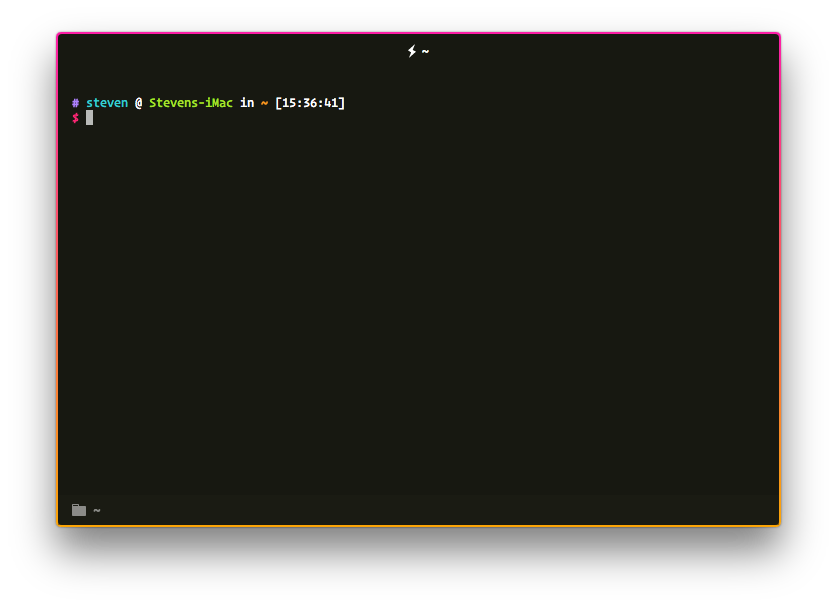

# Hyper

# Plugins:

- [hyperborder](https://github.com/webmatze/hyperborder) - Gives us that nice looking gradient border around the window
- [hyper-tabs-enhanced](https://github.com/henrikdahl/hyper-tabs-enhanced) - Improves the tabs, also adds icons
- [hyper-statusline](https://github.com/henrikdahl/hyper-statusline) - Status bar at the bottom of the terminal, shows directory and git info
- [hyper-final-say](https://github.com/amio/hyper-final-say#readme) - Let's all our customizations in our hyper.js config overwrite those set by plugins
